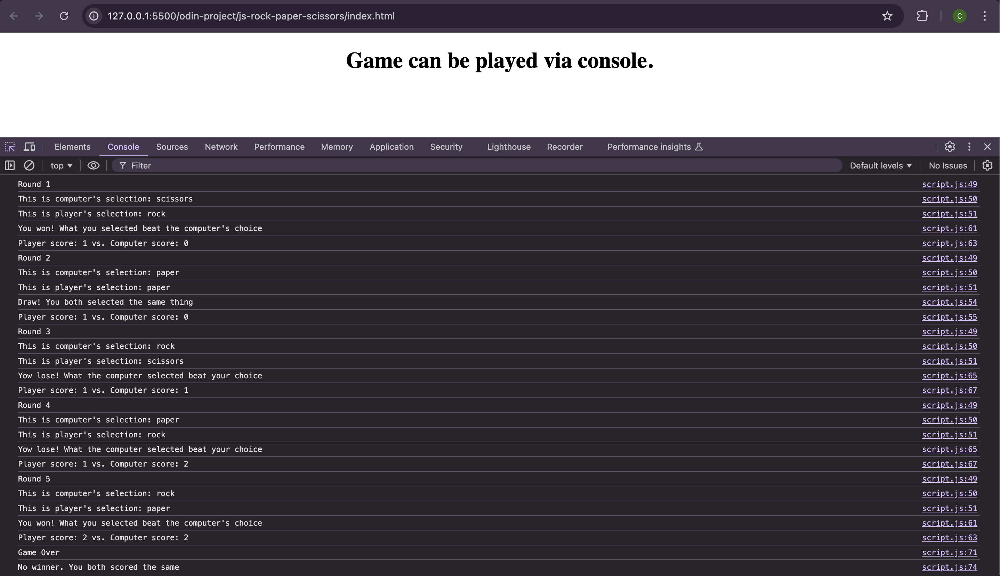

# Rock Paper Scissors Console Game

## Context

This project aims to showcase my foundational knowledge of JavaScript by implementing a Rock, Paper, Scissors game. This game is designed to be played in web console.

## Concepts Used

- Variables
- Functions
- Math Object
- Control Structures
- User Input
- String Methods
- Increment Operators
- Console Output

## Final Result

Below is a sample of the game being played in web's console:

